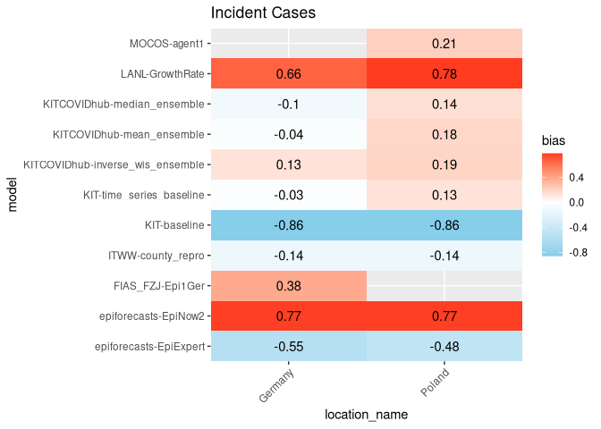
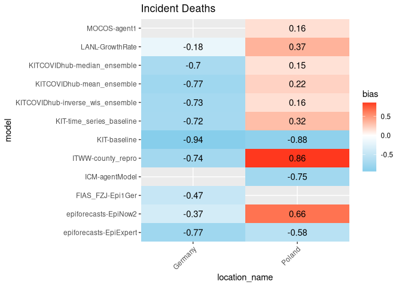

Forecast Hub Report
================

Forecast Hub Report Document
----------------------------

Overview
--------

Overview of all the models and metrics

Interval Score Components
-------------------------

Weighted interval score broken down into its components “overprediction
penalty”, “underprediction penalty” and “sharpness”

Calibration
-----------

### Interval Coverage

Plot of the percentage of true values captured by each prediction
interval

### Quantile Coverage

Plot of the percentage of true values below each predictive quantile
level

Bias
----

