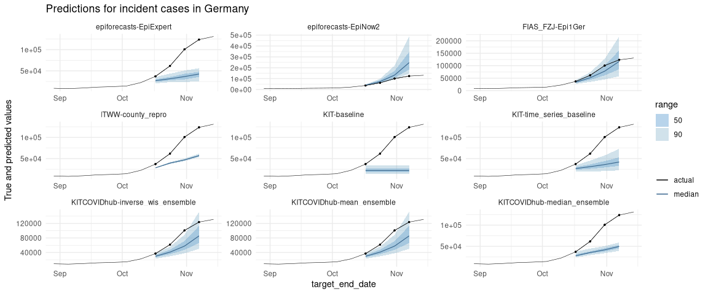
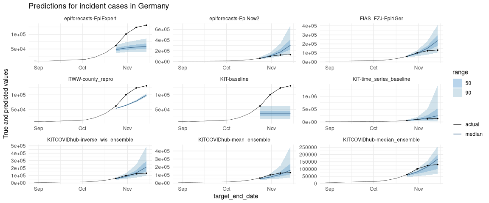
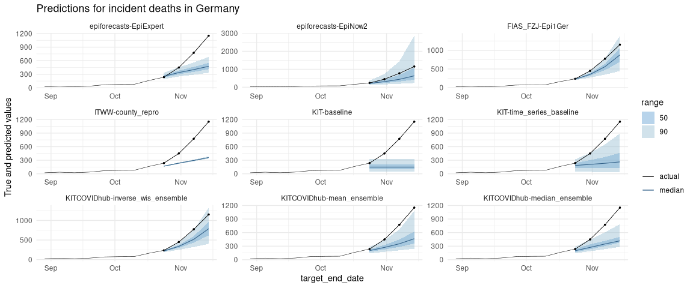
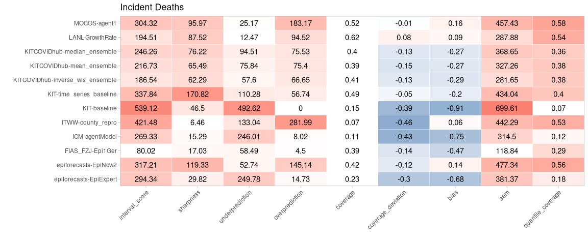
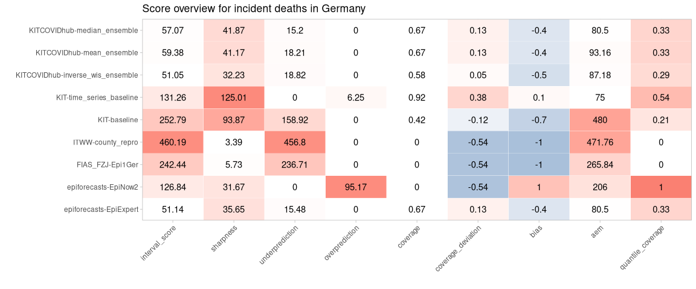
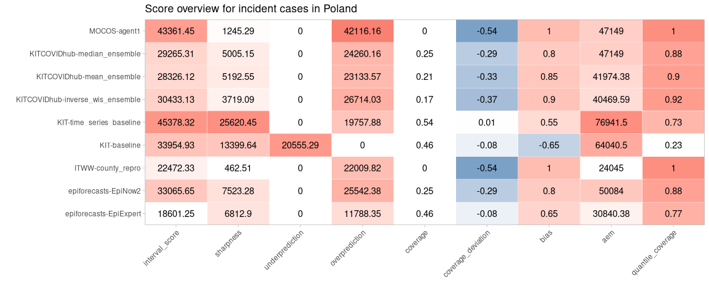
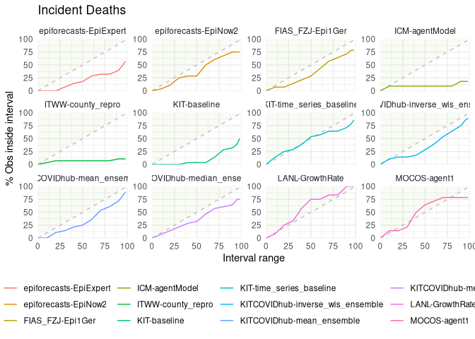

Forecast Evaluation for the German Forecast Hub
================

true

This is a preliminary evaluation of forecasts made for the [German
Forecast Hub](https://github.com/KITmetricslab/covid19-forecast-hub-de).
These evaluations are preliminary - this means I cannot currently rule
out any mistakes and the plots and analyses are subject to change. The
evaluations are not authorised by the German Forecast Hub team.

Feel free to reproduce this analysis. To that end, you can clone this
repository and the Forecast Hub repository, specify the directory of the
submissions files in the R-Markdown script and run the script.

If you have questions or want to give feedback, please create an issue
in this repository.

Forecast Visualisation
======================

Germany
-------

### 2020-10-12

### 2020-10-19

### 2020-10-26

### 2020-11-02

### 2020-11-09

Poland
------

### 2020-10-12

### 2020-10-19

### 2020-10-26

### 2020-11-02

### 2020-11-09

Score Overview
==============

Overview of all the models and metrics

Overall
---------------------------------------------------------------------------------------

Germany
-------

### Overall

\#\#\#
2020-10-12

### 2020-10-19

### 2020-10-26

### 2020-11-02

### 2020-11-09

Poland
------

### Overall

\#\#\#
2020-10-12

### 2020-10-19

### 2020-10-26

### 2020-11-02

### 2020-11-09

Interval Score Components
-------------------------

Weighted interval score broken down into its components “overprediction
penalty”, “underprediction penalty” and “sharpness”

Calibration
-----------

### Interval Coverage

Plot of the percentage of true values captured by each prediction
interval

### Quantile Coverage

Plot of the percentage of true values below each predictive quantile
level

Bias
----

